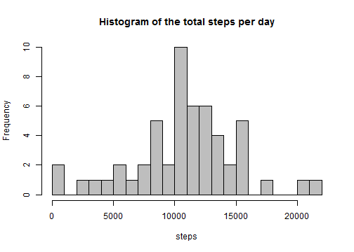
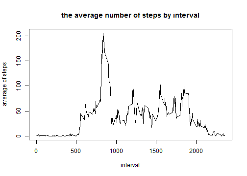
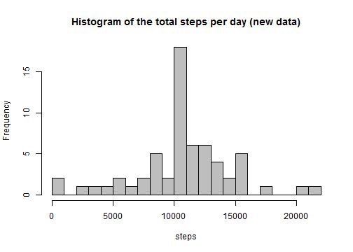

# Reproducible Research: Peer Assessment 1

## Introduction

This is the assignment 1 of Data Science Specialization from Coursera.

This assignment makes use of data from a personal activity monitoring device. This device collects data at 5 minute intervals through out the day. The data consists of two months of data from an anonymous individual collected during the months of October and November, 2012 and include the number of steps taken in 5 minute intervals each day.

You need to set up your own work directory and install the necessary R packages "knitr" and "lattice":


```r
library(knitr)
```

## Loading and preprocessing the data


```r
# you need to set up your own work directory 

# check if the activity.csv file exists in your work directory.
# if not, download it and unzip it

file_name = "activity.csv"
file_url <- "https://d396qusza40orc.cloudfront.net/repdata%2Fdata%2Factivity.zip"

if (!file.exists("activity.csv")) {
  download.file(file_url, destfile = paste(getwd(), "/", "activity.zip", sep = ""))
  unzip("activity.zip")
}

# read in data
activity_data <- read.csv(file_name, header = T)

# convert date value
activity_data$date <- as.Date(activity_data$date, "%Y-%m-%d")
```
The variables included in this dataset are:

* <b>steps</b>: Number of steps taking in a 5minute interval (missing values are coded as NA )
* <b>date</b>: The date on which the measurement was taken in YYYYMMDD format
* <b>interval</b>: Identifier for the 5minute interval in which measurement was taken


## What is mean total number of steps taken per day?

Q1. Make a histogram of the total number of steps taken each day

```r
# the total number of steps taken each day
daily_data <- aggregate(steps ~ date, data = activity_data, FUN = sum)

# histogram of the total number of steps taken each day
hist(daily_data$steps,  breaks = 20, col = "grey",
     main = "Histogram of the total steps per day",
     xlab = "steps")
```

 

Q2. Calculate and report the mean and median total number of steps taken per day

```r
# calculate mean and median
options("scipen"=100, "digits"=0)
daily_data_mean <- mean(daily_data$steps)
daily_data_median <- median(daily_data$steps)
```
<b>Conclusion</b>: The total number of steps taken per day has the mean of <b><font color="red">10766</font></b> and the mediam of <b><font color="red">10765</font></b>.


## What is the average daily activity pattern?

Q1. Make a time series plot of the 5-minute interval (x-axis) and the average number of steps taken, averaged across all days (y-axis)

```r
# the average number of steps by interval
interval_data <- aggregate(steps ~ interval, data = activity_data, FUN = mean)

# time series plot
plot(interval_data, type = "l", 
     xlab = "interval", ylab = "average of steps",
     main = "the average number of steps by interval")
```

 

Q2. Which 5-minute interval, on average across all the days in the dataset, contains the maximum number of steps?


```r
# interval with max steps
max_steps <- max(interval_data$steps)
max_interval <- interval_data$interval[which(interval_data$steps == max_steps)]
```
<b>Conclusion:</b> Interval <b><font color="red">835</font></b> has the maximum number of steps on average across all the days, the maximum is 206 steps.

## Imputing missing values

Q1. Calculate and report the total number of missing values in the dataset (i.e. the total number of rows with NAs)


```r
# total number of rows with NAs
number_NA <- sum(is.na(activity_data$steps))
```
<b>Conclusion:</b> total number of rows with NAs is <b><font color="red">2304</font></b>.

Q2. Devise a strategy for filling in all of the missing values in the dataset. The strategy does not need to be sophisticated. For example, you could use the mean/median for that day, or the mean for that 5-minute interval, etc.

<b>Strategy</b>: If the steps is missing, we will use the mean of that 5 minutes inveral as the estimate. Merge the average steps for each interval to the original data and call it as the new column "steps_avg". If "steps" is missing, then use the value at "steps_avg".


```r
# use the mean of that 5-minute interval to fill in missing values

# add daily average to the original data
names(interval_data) = c("interval", "steps_avg")

activity_data1 = merge(activity_data, interval_data, by = "interval", all.x=T)

activity_data1$steps = ifelse(is.na(activity_data1$steps),
                                 activity_data1$steps_avg,
                                 activity_data1$steps)
```

Q3. Create a new dataset that is equal to the original dataset but with the missing data filled in.


```r
# select "steps", "date", "interval" from data "activity_data1"
activity_data_new = activity_data1[,c("steps", "date", "interval")]

# order by date and interval
activity_data_new = activity_data_new[order(activity_data_new$date, activity_data_new$interval),]

write.csv(activity_data_new, "activity_new.csv", row.names=F)
```

Q4. Make a histogram of the total number of steps taken each day and Calculate and report the mean and median total number of steps taken per day. Do these values differ from the estimates from the first part of the assignment? What is the impact of imputing missing data on the estimates of the total daily number of steps?


```r
# the total number of steps taken each day
daily_data_new <- aggregate(steps ~ date, data = activity_data_new, FUN = sum)

# histogram of the total number of steps taken each day
hist(daily_data_new$steps,  breaks = 20, col = "grey",
     main = "Histogram of the total steps per day (new data)",
     xlab = "steps")
```

 


```r
# calculate mean and median
daily_data_mean_new <- mean(daily_data_new$steps)
daily_data_median_new <- median(daily_data_new$steps)
```
<b>Conclusion</b>: After filling in the missing value, the total number of steps taken per day has the mean of <b><font color="red">10766</font></b> and the mediam of <b><font color="red">10766</font></b>.

The mean is the same as with the original data, while the median changes a little bit. Imputing missing data doesn't affect the mean and median of the total daily number of steps too much.


## Are there differences in activity patterns between weekdays and weekends?
    
Q1. Create a new factor variable in the dataset with two levels -- "weekday" and "weekend" indicating whether a given date is a weekday or weekend day.

```r
# calculate weekday
activity_data_new$weekday <- as.factor(weekdays(activity_data_new$date,abbreviate = T))

# determine weekday and weekend
activity_data_new$group = ifelse(activity_data_new$weekday %in% c("Sat", "Sun"),
                                 "weekend", "weekday")
activity_data_new$group = as.factor(activity_data_new$group)
```

Q2. Make a panel plot containing a time series plot (i.e. type = "l") of the 5-minute interval (x-axis) and the average number of steps taken, averaged across all weekday days or weekend days (y-axis). The plot should look something like the following, which was creating using simulated data:


```r
# the average number of steps by interval and by weekday/weekend
interval_data_new <- aggregate(steps ~ interval+group, data = activity_data_new, FUN = mean)

# time series plot
library(lattice)    
xyplot(steps ~ interval | group, interval_data_new, 
       type = "l", layout = c(1, 2), 
       xlab = "Interval", ylab = "Number of steps")
```

 


```r
# summary statistics of the weekday pattern and weekend pattern
tapply(interval_data_new$steps, interval_data_new$group, summary)
```

```
## $weekday
##    Min. 1st Qu.  Median    Mean 3rd Qu.    Max. 
##       0       2      26      36      51     230 
## 
## $weekend
##    Min. 1st Qu.  Median    Mean 3rd Qu.    Max. 
##       0       1      32      42      75     167
```

<b>Conclusion</b>: The activity patterns for weeday and weekend are different.
